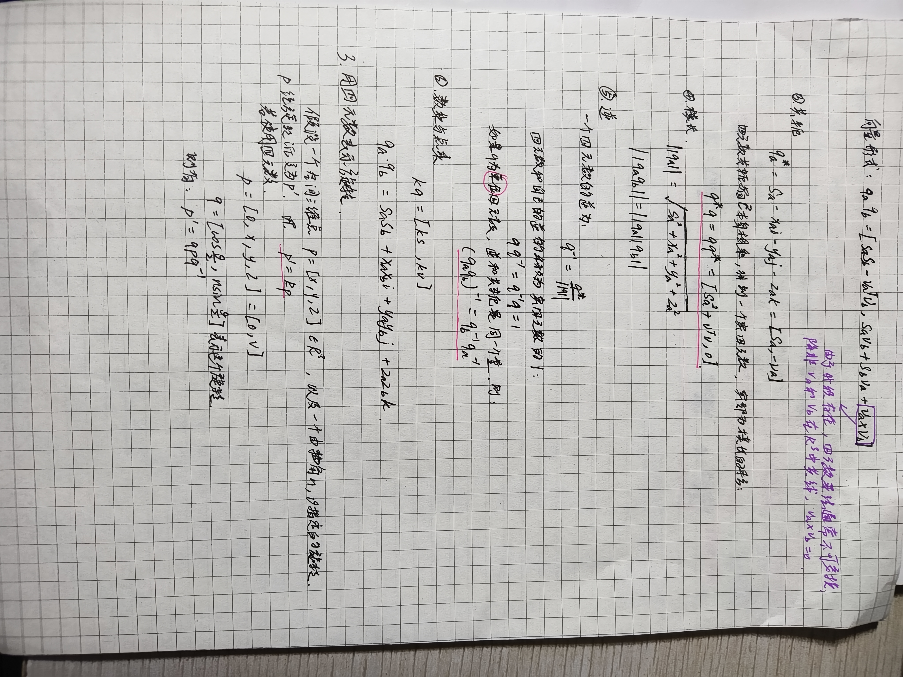
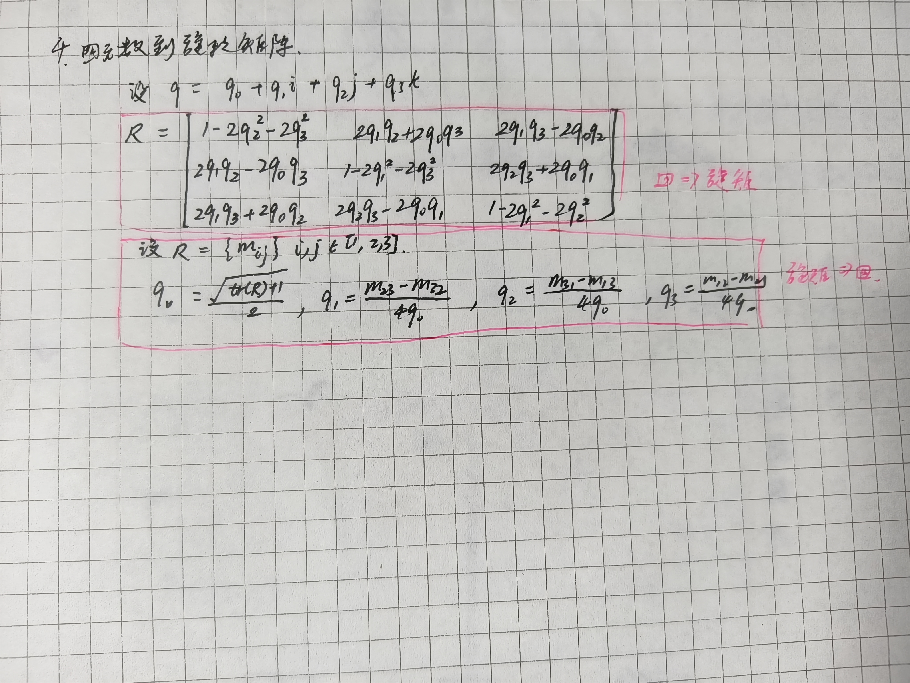

# 主要用于记录三位空间刚体运动的三种表示方法
## detail:

## summary

使用旋转矩阵，会显得冗余（即：九个量表达三个自由度的旋转），变换矩阵同理（使用十六个量表达六自由度的变换）

->

使用欧拉角(yaw-pitch-roll)，会出现奇异性问题：万向锁(Gimbal Lock)问题，并且不适用于插值和迭代

->

使用四元数 $p=p_0+p_1i+p_2j+p_3k $ 缺点是：不够直观，且计算稍微有点复杂

